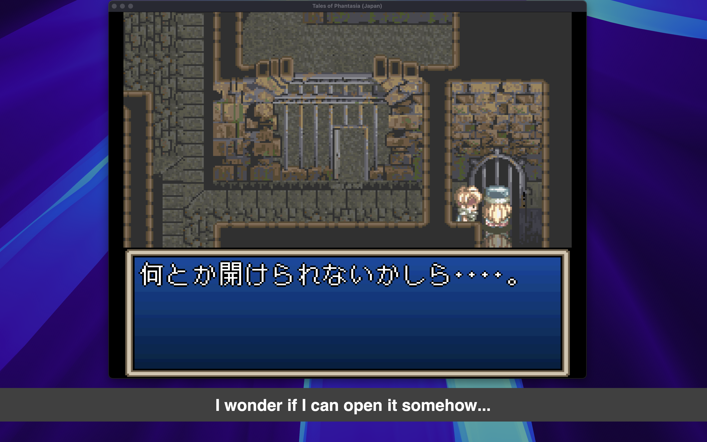

# Interpreter

Offline screen translator for Japanese retro games. Captures text from any window, performs OCR, translates to English, and displays subtitles in a floating overlay.



## Features

- **Fully offline** - No cloud APIs, no internet required after setup
- **Free** - No API costs or subscriptions
- **Private** - Text never leaves your machine
- **Optimized for retro games** - Uses MeikiOCR, trained specifically on Japanese game text
- **Two overlay modes** - Banner (subtitle bar) or inplace (text over game)
- **Translation caching** - Fuzzy matching avoids re-translating similar text
- **Multi-display support** - Overlay appears on the same display as the game

## Requirements

- **Windows 10 version 1903+**, macOS, or Linux (X11/XWayland/Wayland)

### Linux Notes

- **Global hotkeys** require `input` group membership. The installer will show instructions.
- **Native Wayland capture** requires GStreamer PipeWire plugin. The installer will attempt to install it automatically.
- **Inplace overlay** on Wayland only works with fullscreen windows (Wayland's security model prevents knowing window positions).

## Installation

### One-liner Install

**macOS/Linux:**
```bash
curl -LsSf https://raw.githubusercontent.com/bquenin/interpreter/main/install.sh | bash
```

**Windows (PowerShell):**
```powershell
powershell -c "irm https://raw.githubusercontent.com/bquenin/interpreter/main/install.ps1 | iex"
```

Then run with `interpreter-v2`.

## Upgrading

To update to the latest version, run the installer again (see Installation above).

## Uninstalling

**macOS/Linux:**
```bash
curl -LsSf https://raw.githubusercontent.com/bquenin/interpreter/main/uninstall.sh | bash
```

**Windows (PowerShell):**
```powershell
powershell -c "irm https://raw.githubusercontent.com/bquenin/interpreter/main/uninstall.ps1 | iex"
```

This removes interpreter-v2, config files, and cached models.

## Usage

```bash
interpreter-v2
```

This opens the GUI where you can select a window to capture and configure all settings.

## Overlay Modes

### Banner Mode (default)
A subtitle bar at the bottom of the screen displaying translated text. Draggable, opaque background, centered text.

### Inplace Mode
Transparent overlay positioned over the game window. Translated text appears directly over the original Japanese text at OCR-detected positions. Click-through so you can interact with the game.

## How It Works

1. **Screen Capture** - Captures the target window at the configured refresh rate
2. **OCR** - [MeikiOCR](https://github.com/rtr46/meikiocr) extracts Japanese text (optimized for pixel fonts)
3. **Translation** - [Sugoi V4](https://huggingface.co/entai2965/sugoi-v4-ja-en-ctranslate2) translates Japanese to English
4. **Display** - Shows translated text in the selected overlay mode

## Troubleshooting

### Poor OCR accuracy
Try adjusting the OCR confidence slider in the GUI. Lower values include more text (but may include garbage), higher values are stricter.

### Slow performance
First run downloads models (~1.5GB). Subsequent runs use cached models from `~/.cache/huggingface/`.
