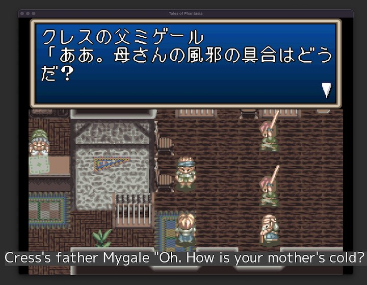

# Interpreter

Offline screen translator for Japanese retro games. Captures text from any window, performs OCR, translates to English, and displays subtitles in a floating overlay.



## Features

- **Fully offline** - No cloud APIs, no internet required after setup
- **Free** - No API costs or subscriptions
- **Private** - Text never leaves your machine
- **Optimized for retro games** - Uses MeikiOCR, trained specifically on Japanese game text
- **Two overlay modes** - Banner (subtitle bar) or inplace (text over game)
- **Translation caching** - Fuzzy matching avoids re-translating similar text

## Requirements

- Python 3.11+
- macOS or Windows

## Installation

### One-liner Install

**macOS/Linux:**
```bash
curl -LsSf https://raw.githubusercontent.com/bquenin/interpreter/270f763e4ecb3000ae19617a2fdc7187eda868bf/install.sh | bash
```

**Windows (PowerShell):**
```powershell
powershell -c "irm https://raw.githubusercontent.com/bquenin/interpreter/270f763e4ecb3000ae19617a2fdc7187eda868bf/install.ps1 | iex"
```

Then run with `interpreter-v2`.

## Usage

```bash
# List available windows
uv run interpreter --list-windows

# Run with default config
uv run interpreter

# Run with specific window
uv run interpreter --window "Tales"

# Start in inplace mode (text over game)
uv run interpreter --overlay-mode inplace

# Debug mode (show OCR confidence scores)
uv run interpreter --debug
```

## Controls

| Key | Action |
|-----|--------|
| `m` | Cycle overlay mode: off → banner → inplace |
| `-` | Decrease font size |
| `=` | Increase font size |
| `Ctrl+C` | Quit |

In banner mode, you can drag the overlay to reposition it.

## Overlay Modes

### Banner Mode (default)
A subtitle bar at the bottom of the screen displaying translated text. Draggable, opaque background, centered text.

### Inplace Mode
Transparent overlay positioned over the game window. Translated text appears directly over the original Japanese text at OCR-detected positions. Click-through so you can interact with the game.

## Configuration

Edit `config.yml`:

```yaml
# Window to capture (partial title match)
window_title: "Tales"

# Refresh rate in seconds
refresh_rate: 0.5

# OCR confidence threshold (0.0-1.0)
# Filters out garbage text by average per-line confidence
ocr_confidence: 0.6

# Subtitle appearance
font_size: 24
font_color: "#FFFFFF"
background_color: "#404040"
```

## How It Works

1. **Screen Capture** - Captures the target window at the configured refresh rate
2. **OCR** - [MeikiOCR](https://github.com/rtr46/meikiocr) extracts Japanese text (optimized for pixel fonts)
3. **Translation** - [Sugoi V4](https://huggingface.co/entai2965/sugoi-v4-ja-en-ctranslate2) translates Japanese to English
4. **Display** - Shows translated text in the selected overlay mode

## Troubleshooting

### Window not found
Use `--list-windows` to see available windows. The window title is a partial match.

### Poor OCR accuracy
Try adjusting `ocr_confidence` in config. Lower values include more text (but may include garbage), higher values are stricter.

### Slow performance
First run downloads models (~1.5GB). Subsequent runs use cached models from `~/.cache/huggingface/`.

## What's New in v2

- **Inplace overlay mode** - Text appears directly over game text
- **Mode cycling** - Press `m` to switch between off/banner/inplace
- **Font size adjustment** - Press `-`/`=` to resize on the fly
- **Translation caching** - Fuzzy matching reduces redundant translations
- **Improved OCR** - Punctuation excluded from confidence calculation
- **Better window capture** - Excludes overlapping windows, auto-detects fullscreen
- **Multi-display support** - Overlay appears on the same display as the game
