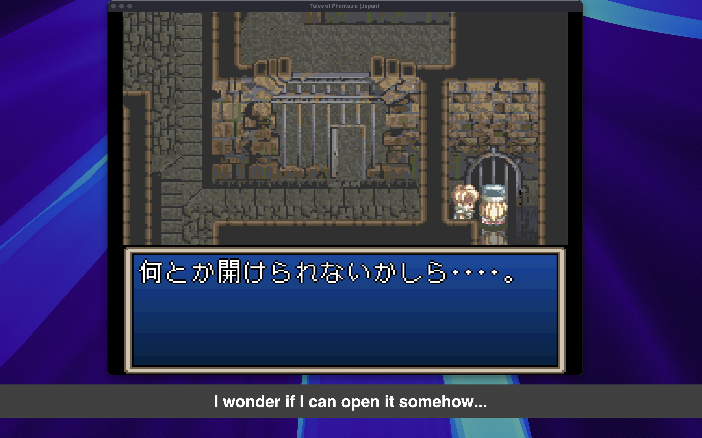

# Interpreter

Offline screen translator for Japanese retro games. Captures text from any window, performs OCR, translates to English, and displays subtitles in a floating overlay.



## Features

- **Fully offline** - No cloud APIs, no internet required after setup
- **Free** - No API costs or subscriptions
- **Private** - Text never leaves your machine
- **Optimized for retro games** - Uses MeikiOCR, trained specifically on Japanese game text
- **Two overlay modes** - Banner (subtitle bar) or inplace (text over game)
- **Translation caching** - Fuzzy matching avoids re-translating similar text
- **Multi-display support** - Overlay appears on the same display as the game

## Requirements

- **Windows 10 version 1903+**, macOS, or Linux (X11/XWayland/Wayland)
- At least 6 GB of free disk space for application dependencies and first-run model downloads

### Linux Notes

- **Global hotkeys** require `input` group membership. The installer will show instructions.
- **Native Wayland capture** requires GStreamer PipeWire plugin. The installer will attempt to install it automatically.
- **Inplace overlay** on Wayland only works with fullscreen windows (Wayland's security model prevents knowing window positions).
- **Qt platform plugin** (`xcb`) requires `libxcb-cursor0` (Debian/Ubuntu/Mint) or `xcb-util-cursor` (Fedora/Arch). Without it the GUI will abort with `Could not load the Qt platform plugin "xcb"`.

## Installation

### One-liner Install

**macOS/Linux:**
```bash
curl -LsSf https://raw.githubusercontent.com/bquenin/interpreter/main/install.sh | bash
```

**Windows (PowerShell):**
```powershell
powershell -c "irm https://raw.githubusercontent.com/bquenin/interpreter/main/install.ps1 | iex"
```

Then run with `interpreter-v2`.

### Installing to a Different Location

By default everything is installed under your user profile (about 3 GB of application files plus 1.1 GB of models on first run). If your system drive is short on space, set `INTERPRETER_HOME` to a folder on another drive before running the installer:

**macOS/Linux:**
```bash
curl -LsSf https://raw.githubusercontent.com/bquenin/interpreter/main/install.sh | INTERPRETER_HOME=/mnt/data/interpreter bash
```

**Windows (PowerShell):**
```powershell
$env:INTERPRETER_HOME = "D:\interpreter"; powershell -c "irm https://raw.githubusercontent.com/bquenin/interpreter/main/install.ps1 | iex"
```

The application, its Python runtime, and the downloaded models all go under that folder. The location is remembered in `~/.interpreter/install-dir`, so later upgrades and the uninstaller use it without setting the variable again. Only the small `interpreter-v2` launcher and your `config.yml` stay in your user profile.

To change the location later, run the installer again with a new `INTERPRETER_HOME`. It removes the application from the old location and reinstalls it in the new one. Models are downloaded again on first run; the installer prints where the old ones are so you can delete them.

To go back to the default location, run the uninstaller (see below) and then the plain installer.

## Upgrading

To update to the latest version, run the installer again (see Installation above).

## Uninstalling

**macOS/Linux:**
```bash
curl -LsSf https://raw.githubusercontent.com/bquenin/interpreter/main/uninstall.sh | bash
```

**Windows (PowerShell):**
```powershell
powershell -c "irm https://raw.githubusercontent.com/bquenin/interpreter/main/uninstall.ps1 | iex"
```

This removes interpreter-v2, config files, and cached models.

## Usage

```bash
interpreter-v2
```

This opens the GUI where you can select a window to capture and configure all settings.

## Overlay Modes

### Banner Mode (default)
A subtitle bar at the bottom of the screen displaying translated text. Draggable, opaque background, centered text.

### Inplace Mode
Transparent overlay positioned over the game window. Translated text appears directly over the original Japanese text at OCR-detected positions. Click-through so you can interact with the game.

## How It Works

1. **Screen Capture** - Captures the target window at the configured refresh rate
2. **OCR** - [MeikiOCR](https://github.com/rtr46/meikiocr) extracts Japanese text (optimized for pixel fonts), or an external [owocr](https://github.com/AuroraWright/owocr) server if you prefer another engine
3. **Translation** - [Sugoi V4](https://huggingface.co/entai2965/sugoi-v4-ja-en-ctranslate2) translates Japanese to English
4. **Display** - Shows translated text in the selected overlay mode

## Using a Different Translation Model (Ollama / OpenAI-compatible)

Sugoi V4 is the built-in default and needs no setup. If you want to try a larger language model, the **Translation** panel in the main window can send text to an [Ollama](https://ollama.com) server or to any OpenAI-compatible endpoint (LM Studio, llama.cpp server, vLLM, OpenRouter, OpenAI, ...). You bring the model; Interpreter only sends the OCR text and shows the reply.

### Quick start with Ollama

1. Install Ollama and pull a model. The recommended one is Sugoi 14B Ultra, a Japanese-media translation model (Apache-2.0) that needs about 10 GB of VRAM:
   ```bash
   ollama pull hf.co/sugoitoolkit/Sugoi-14B-Ultra-GGUF:Q4_K_M
   ```
   On the project's benchmark it scores +12 chrF++ over the built-in Sugoi V4 across every game (see `benchmark/translation/RESULTS.md`). With less VRAM, `gemma3:4b` (3.3 GB) is roughly on par with the built-in model; anything under 2B mostly outputs romaji or nonsense.
2. In Interpreter, set **Engine** to *LLM endpoint*, keep the provider on *Ollama* and the URL on `http://127.0.0.1:11434`, click **Refresh** and pick the model.
3. Click **Test**. It translates a sample line and shows the round-trip time. Then click **Apply**; the translation engine reloads without interrupting capture.

Use `127.0.0.1`, not `localhost`: on Windows, `localhost` adds about two seconds to every request.

### What to expect

- **Speed**: on an RTX 4070 Ti, Sugoi 14B Ultra answers in about 300 ms per line (1.2 s at p95) and `gemma3:4b` in about 100 ms. CPU-only machines take seconds per line, which is fine for dialogue and painful for menus. The fuzzy translation cache still avoids re-translating text that has not changed. Keep only one large model in use at a time: two 8 GB models on a 12 GB card evict each other on every request.
- **Quality**: larger models keep names and tone more consistent, and the previous few lines are sent as context. They also know many games and may use the official localized names instead of a literal translation. Edit the **Prompt** if you want different behaviour.
- **Reasoning models** (Qwen3 and friends): thinking is turned off automatically on Ollama. Other servers each have their own switch, so set it through `request_options` in `config.yml`; the fields are merged into every request, for example `request_options: {reasoning_effort: none}`. Stripping inline `<think>` blocks from the reply is only a fallback and does not save the thinking time. If a server rejects an option, the **Test** button shows its error.
- **Target language**: the LLM engine can translate into any language the model handles. For games that are not in Japanese, see *Games in Other Languages* below.
- **Remote endpoints**: the API key is stored in plain text in `config.yml`, every line of game text leaves your machine, and each request may cost money. Nothing is sent anywhere unless you pick the LLM engine.

The same settings live in `config.yml` under `translation_backend` and `llm` if you prefer editing them by hand.

## Using a Different OCR Engine (owocr)

MeikiOCR is the built-in default and needs no setup. If it struggles with a particular game's font, the **OCR** panel can hand the screen capture to [owocr](https://github.com/AuroraWright/owocr) instead. owocr is a separate program that wraps many OCR engines behind one interface: Google Lens, Bing, OneOCR (Windows), Apple Live Text (macOS), Chrome Screen AI, MeikiOCR, Manga OCR, EasyOCR, RapidOCR and more. You run owocr with the engine of your choice; Interpreter sends it each frame over a local websocket and reads back the text and its positions.

### Quick start

1. Install owocr in its own Python environment (not Interpreter's), with the engine you want. OneOCR is the best local choice on Windows 10/11; Google Lens works on every platform but needs internet:
   ```bash
   pip install "owocr[oneocr]"   # Windows: uses the Snipping Tool OCR
   pip install "owocr[lens]"     # any platform: Google Lens (cloud)
   ```
   The [prebuilt owocr packages](https://github.com/AuroraWright/owocr/releases) for Windows and macOS bundle every engine; they keep their tray icon, but the options below are all available in their configuration window.
2. Start owocr as a websocket server. Replace `oneocr` with `glens`, `meikiocr`, `alivetext`, `mangaocrs`, ... for another engine:
   ```bash
   owocr -r websocket -w websocket -of json -e oneocr -el oneocr -t False -rt False -f False -a 0
   ```
   Every flag matters: `-of json` sends coordinates, `-rt False` and `-f False` turn off owocr's text reordering and furigana filter (the filter silently drops lines), `-a 0` stops owocr from pausing itself, and `-t False` hides the tray icon.
3. In Interpreter, set the OCR **Engine** to *owocr*, keep the URL on `ws://127.0.0.1:7331`, click **Test**, then **Apply**. The OCR engine switches without interrupting capture.

### What to expect

- **Confidence**: owocr engines return no confidence scores, so the OCR confidence slider has no effect with this engine. Exclusion zones in *Configure OCR* still apply.
- **Speed**: owocr checks for new frames every 100 ms, so add that to the engine's own time. OneOCR and MeikiOCR answer in well under a second; Google Lens takes one to two seconds per frame and sends every frame to Google.
- **Layout**: each text line becomes one region. Vertical text comes back as one region per column.
- **Errors**: if owocr stops or is paused, the OCR status turns to *Error* after three failed frames. Start owocr again and click **Fix Models** to reconnect.
- **One client at a time**: owocr broadcasts every result to every connected client, so run a dedicated owocr instance for Interpreter. owocr also listens on all network interfaces; keep port 7331 firewalled.
- **Remote owocr**: owocr speaks plain `ws://`, so pointing Interpreter at another machine sends every screen capture unencrypted over the network. Interpreter warns when the address is not local. On an untrusted network put a TLS proxy in front of owocr and use a `wss://` URL.
- **Languages**: with owocr selected, the **Source language** dropdown in the OCR group unlocks. See *Games in Other Languages* below.

The same settings live in `config.yml` under `ocr_backend` and `owocr`.

## Games in Other Languages

Interpreter can read and translate games in Chinese, Korean, English, French, German, Spanish, Italian, Portuguese and Russian, not only Japanese. The built-in engines cannot: MeikiOCR reads Japanese only and Sugoi V4 translates Japanese to English only. So a non-Japanese game needs both alternative engines:

1. Run owocr with an engine that reads the script (Google Lens, Bing, OneOCR and Apple Live Text all do; see *Using a Different OCR Engine*). In the **OCR** group pick *owocr*, then choose the **Source language**. The dropdown is locked to Japanese while MeikiOCR is selected.
2. In the **Translation** group pick *LLM endpoint* with a model that knows the language, set the **Target language**, click **Test** (it translates a sample line in the source language) and **Apply**.

Apply refuses the combination of a non-Japanese source with Sugoi V4, and says so. The source language is also used to filter OCR noise: only regions that contain characters from that language's script are translated. The setting lives in `config.yml` as `source_language`.

## Troubleshooting

### Poor OCR accuracy
Try adjusting the OCR confidence slider in the GUI. Lower values include more text (but may include garbage), higher values are stricter.

### Slow performance
First run downloads models (~1.5GB). Subsequent runs use cached models from `~/.cache/huggingface/`.
